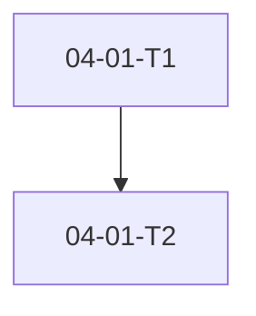

## Phase Goal

**As a** developer, **I want to** transform any approved spec into parallel-ready atomic task plans, **so that** I can execute work with explicit approval gates and verifiable deliverables per task.

<objective>
Deliver the plan-phase workflow skill, contract tests, and README documentation: the user-facing `/plan-phase` orchestration that reads an approved SPEC.md, runs mandatory research and plan-checker revision loop, produces todo-format PLAN.md files, and enforces the approve-all gate.

Purpose: PLAN-01 through PLAN-05 are satisfied by this skill — the primary deliverable developers invoke after spec approval. Depends on Plan 04-01 validate_plan.py for belt-and-suspenders confirmation at approval.

Output: `mise-en-place/plan-phase/SKILL.md` + `test_plan_phase_contract.py` + updated `mise-en-place/README.md`.
</objective>

<execution_context>
@.cursor/get-shit-done/workflows/execute-plan.md
@.cursor/get-shit-done/templates/summary.md
</execution_context>

<context>
@.planning/PROJECT.md
@.planning/ROADMAP.md
@.planning/phases/04-plan-phase/04-CONTEXT.md
@.planning/phases/04-plan-phase/04-RESEARCH.md
@.planning/phases/04-plan-phase/04-PATTERNS.md
@.planning/phases/04-plan-phase/04-01-SUMMARY.md

<interfaces>
From Plan 04-01 (must exist before this plan runs):
- validate_plan.py: python3 mise-en-place/tool-validate-plan/validate_plan.py --phase-dir .planning/phases/{slug}
- Exit 0: all *-PLAN.md approved with valid todo + Verify sub-bullets
- Exit 1: draft status, missing tasks, missing Verify, path errors

From mise-en-place/tool-validate-spec/validate_spec.py:
- Entry gate: python3 mise-en-place/tool-validate-spec/validate_spec.py — exit 0 only when SPEC.md approved

From mise-en-place/spec-phase/SKILL.md (patterns to replicate):
- cursor_skill_adapter block (lines 6–28)
- Research sub-agent spawn: Task(subagent_type="generalPurpose"), no model parameter
- Approval gate: yes / edit / abort with StrReplace status patch

End-user PLAN.md template (D-06/D-15 — NOT GSD XML):
```markdown
---
status: draft
phase: {slug}
plan: 01
requirements:
  - REQ-ID
---

## Objective
...



## Tasks

[PENDING] 04-01-T1 - Task title
  - [ ] Verify: single observable outcome
  - Depends: (none)

[PENDING] 04-01-T2 - Next task
  - [ ] Verify: another observable outcome
  - Depends: 04-01-T1
```
</interfaces>
</context>

<tasks>

<task type="auto">
  <name>Write plan-phase/SKILL.md — full orchestration workflow (D-01 through D-24)</name>
  <files>mise-en-place/plan-phase/SKILL.md</files>

  <read_first>
    - mise-en-place/spec-phase/SKILL.md (full file — replicate adapter, step structure, research spawn, approval gate patterns)
    - mise-en-place/tool-validate-spec/SKILL.md (belt-and-suspenders cross-reference pattern)
    - mise-en-place/tool-validate-plan/SKILL.md (from Plan 04-01 — exit gate at approval)
    - .planning/phases/04-plan-phase/04-CONTEXT.md (D-01 through D-24 — every locked decision must appear in a step)
    - .planning/phases/04-plan-phase/04-RESEARCH.md (Pattern 3 plan-checker loop, Pattern 4 mandatory research, Anti-Pattern 1 dual format warning)
    - .planning/phases/04-plan-phase/04-PATTERNS.md (plan-phase SKILL analog assignments)
    - research/frameworks/gsd.md (plan-checker VERIFICATION PASSED / ISSUES FOUND markers — if accessible via Read)
  </read_first>

  <action>
    Create mise-en-place/plan-phase/ directory. Write mise-en-place/plan-phase/SKILL.md:

    FRONTMATTER: name: plan-phase, description: "Read approved SPEC.md → mandatory research → todo-format PLAN.md → plan-checker loop → approval gate"

    CURSOR_SKILL_ADAPTER: copy structure from spec-phase/SKILL.md Sections A–D. Invocation trigger: user mentions plan-phase or /plan-phase.

    OBJECTIVE: Transform an approved .planning/SPEC.md into one or more executable todo-format PLAN.md files under .planning/phases/{slug}/, with mandatory research, bounded plan-checker revision, and explicit approve-all gate before execution.

    PROCESS — exactly six numbered steps:

    STEP 1 — STARTUP AND ENTRY GATE (D-20, PLAN-05):
    Run: python3 mise-en-place/tool-planning-scaffold/planning_scaffold.py scaffold
    Run: python3 mise-en-place/tool-validate-spec/validate_spec.py
    If exit ≠ 0: STOP with stderr message — do not proceed. Remind developer to complete /spec-phase approval gate.
    Read .planning/SPEC.md — extract Success Criteria, Constraints, Out of Scope for planning context.
    Read .planning/codebase/*.md if present (optional enrichment — do not require).
    Confirm phase slug with developer: derive from SPEC title or ask user to confirm/create .planning/phases/{slug}/ directory. Set PHASE_DIR = .planning/phases/{slug}/.
    Clean-context note: all inputs from local files only; no prior session history assumed.

    STEP 2 — MANDATORY RESEARCH (D-23, D-21):
    Before writing ANY PLAN.md: spawn 1–3 parallel Task(subagent_type="generalPurpose") researchers. Do NOT pass model parameter.
    Derive research topics from SPEC.md Constraints and Success Criteria (agent discretion per CONTEXT Claude's Discretion).
    Each sub-agent prompt includes: Topic, Project context from SPEC, Output file path, File format (# Research, ## Summary, ## Key Findings, ## Implications for Plan, ## Sources), instruction to keep concise.
    After sub-agents complete: synthesize findings into single Write to {PHASE_DIR}/{phase}-RESEARCH.md (consolidated file per RESEARCH A3).
    Do NOT write per-topic files under `.planning/research/` for plan-phase — synthesize to `{phase}-RESEARCH.md` only (RESEARCH A3; differs from spec-phase per-topic pattern).
    Read {phase}-RESEARCH.md before proceeding — research is NOT optional even for simple specs.

    STEP 3 — PLAN GENERATION (D-01, D-06 through D-15, PLAN-02):
    Default: produce single {phase}-01-PLAN.md (D-01).
    Split trigger (D-02): if developer says "split into X and Y" or "two parallel plans" — BEFORE writing files, present split preview (D-04): proposed plan filenames, scope per stream, wave assignment. Wait for developer confirmation.
    Parallel plan rule (D-03): parallel plans must have NO cross-plan depends_on. Shared/blocking work goes in a prior-wave plan, not split across parallel streams.
    For each plan, Write todo-format PLAN.md (NOT GSD XML — critical distinction per RESEARCH Pitfall 1):
    - Frontmatter (D-15): status: draft, phase: {slug}, plan: {NN}, requirements: [list from SPEC mapping]
    - ## Objective — derived from SPEC Success Criteria
    - Mermaid graph immediately after Objective, before task list (D-12/D-13): graph TD with TASKID nodes and dependency edges
    - ## Tasks section with tasks as [PENDING] {plan}-T{n} - Title (D-07/D-08/D-14)
    - Each task: indented `  - [ ] Verify: <single observable outcome>` (D-09)
    - Optional `  - Depends: {TASKID}` sub-bullet (D-12)
    - Task sizing guidance in skill text (D-10): one file or one script per task — script + tests are two tasks
    - Structured-soft enforcement (D-05): SKILL requires Verify per task; validate_plan.py checks presence only

    STEP 4 — PLAN-CHECKER REVISION LOOP (D-21, D-22, D-24):
    After first plan draft(s): spawn Task(subagent_type="generalPurpose") plan-checker sub-agent.
    Checker prompt must include: phase goal from SPEC Success Criteria, locked decisions from {phase}-CONTEXT.md if exists, all draft PLAN.md paths, output path {PHASE_DIR}/{phase}-REVIEWS.md.
    Checker classifies issues as BLOCKER or WARNING; ends with ## VERIFICATION PASSED or ## ISSUES FOUND.
    Orchestrator reads REVIEWS.md: if ISSUES FOUND, revise plan(s) and re-run checker. Max 3 cycles (D-24). After 3 cycles with unresolved BLOCKERs: escalate to developer with summary.
    Do NOT proceed to approval gate while BLOCKER issues remain unaddressed.

    STEP 5 — APPROVAL GATE (D-16, D-17, D-18, PLAN-04):
    Present plan summary: objective per plan, task count, file paths, Mermaid overview.
    Ask: **"Approve all plans? Reply with: yes / edit / abort"**
    - **yes:** Glob all *-PLAN.md in PHASE_DIR. StrReplace `status: draft` → `status: approved` on EVERY plan file (approve-all, not per-file — D-16). Confirm count to developer. Run: python3 mise-en-place/tool-validate-plan/validate_plan.py --phase-dir {PHASE_DIR}. If exit ≠ 0: report errors, do not claim success. On exit 0: confirm "Plans approved ✓ — run /exec-phase when ready." Remind exec-phase will re-validate via validate_plan.py (D-19).
    - **edit:** Ask which plan or task to revise. Return to Step 3 for targeted edits. Re-run plan-checker if structural changes. Re-present approval gate.
    - **abort:** Leave all plans as draft. Confirm paths saved. Exit.

    STEP 6 — HANDOFF:
    Summarize artifacts created: {phase}-RESEARCH.md, {phase}-{NN}-PLAN.md files, {phase}-REVIEWS.md if checker ran.
    Remind: exec-phase (Phase 5) requires validate_plan.py exit 0 before dispatch.

    Commit message: feat(04-02): add plan-phase/SKILL.md — full plan workflow
  </action>

  <acceptance_criteria>
    - mise-en-place/plan-phase/SKILL.md exists
    - File contains name: plan-phase in frontmatter
    - File contains cursor_skill_adapter
    - File contains ## Step 1 through Step 6 (six numbered steps)
    - File contains validate_spec.py (D-20 entry gate)
    - File contains validate_plan.py (D-19 exit confirmation)
    - File contains RESEARCH.md or {phase}-RESEARCH.md (D-23 mandatory research)
    - File contains REVIEWS.md (D-22 plan-checker output)
    - File contains "3 cycles" or "three cycles" or "max 3" (D-24 revision cap)
    - File contains "yes / edit / abort" (D-17 approval prompt)
    - File contains StrReplace and status: approved (D-18 approve-all)
    - File contains [PENDING] and Verify: (D-06/D-09 todo format)
    - File contains ```mermaid (D-13 graph placement)
    - File contains "split" or "parallel" (D-02/D-03 multi-plan support)
    - File contains "Do NOT pass the model parameter" or equivalent (sub-agent convention)
    - File contains clean-context or "local files" or "no session" (PLAN-05)
    - File does NOT instruct writing GSD task XML blocks to end-user plans
  </acceptance_criteria>

  <verify>
    <automated>grep -q "validate_spec.py" mise-en-place/plan-phase/SKILL.md && grep -q "validate_plan.py" mise-en-place/plan-phase/SKILL.md && grep -q "RESEARCH" mise-en-place/plan-phase/SKILL.md && grep -q "\[PENDING\]" mise-en-place/plan-phase/SKILL.md && grep -q "yes / edit / abort" mise-en-place/plan-phase/SKILL.md</automated>
  </verify>

  <done>plan-phase/SKILL.md committed with all D-01 through D-24 decisions mapped to steps. Remaining structural acceptance criteria (15+ checks) are verified authoritatively by Task 2 contract tests — not this task's 5-grep automated verify.</done>
</task>

<task type="auto" tdd="true">
  <name>Write test_plan_phase_contract.py — SKILL structure contract tests</name>
  <files>mise-en-place/plan-phase/test_plan_phase_contract.py</files>

  <read_first>
    - mise-en-place/spec-phase/test_spec_phase_contract.py (contract test pattern: pathlib Path, SKILL.read_text, position ordering via str.find)
    - mise-en-place/plan-phase/SKILL.md (Task 1 output — tests validate this file)
    - .planning/phases/04-plan-phase/04-RESEARCH.md (Validation Architecture — PLAN-01/PLAN-05 test map)
    - .planning/phases/04-plan-phase/04-PATTERNS.md (contract test table lines 488-501)
  </read_first>

  <behavior>
    Contract tests parse plan-phase/SKILL.md structure (not runtime agent behavior):

    - test_validate_spec_entry_gate_documented: assert "validate_spec.py" in SKILL.md (PLAN-01/D-20)
    - test_validate_plan_belt_and_suspenders_documented: assert "validate_plan.py" in SKILL.md (D-19)
    - test_mandatory_research_before_plan: assert "RESEARCH" in text AND research step precedes plan generation (str.find research marker before "[PENDING]" or "PLAN.md" write instruction)
    - test_plan_checker_revision_loop: assert "REVIEWS.md" in text AND ("3 cycles" in text or "three cycles" in text or "max 3" in text)
    - test_approval_gate_yes_edit_abort: assert "yes / edit / abort" in text
    - test_approve_all_strreplace: assert "status: draft" in text AND "status: approved" in text AND "StrReplace" in text
    - test_todo_task_format_documented: assert "[PENDING]" in text AND ("T1" in text or "TASKID" in text or "-T" in text)
    - test_verify_subbullet_documented: assert "Verify:" in text
    - test_mermaid_after_objective: assert "```mermaid" in text AND "Objective" in text
    - test_no_model_param_on_subagents: assert "Do NOT pass the" in text and "model" in text
    - test_no_session_state_dependency: assert "local files" in text.lower() or "clean context" in text.lower() or "no session" in text.lower() or "no prior session" in text.lower() (PLAN-05)
    - test_multi_plan_split_documented: assert "split" in text.lower() or "parallel" in text.lower() (PLAN-03)
    - test_no_cross_plan_deps_documented: assert "cross-plan" in text.lower() or "no cross-plan" in text.lower() (D-03)
    - test_task_sizing_guidance: assert "one file" in text.lower() or "one script" in text.lower() (D-10)
    - test_depends_subbullet_documented: assert "Depends:" in text (D-12)
    - test_all_pending_at_creation: assert "[PENDING]" in text and ("at creation" in text.lower() or "written as [PENDING]" in text.lower() or D-14 reference via "[PENDING]" default) (D-14)
    - test_planning_scaffold_startup_documented: assert "planning_scaffold.py" in text and text.find("planning_scaffold") < text.find("PLAN.md") or text.find("plan generation") > 0 (Step 1 scaffold precedes plan generation)
  </behavior>

  <action>
    Write mise-en-place/plan-phase/test_plan_phase_contract.py:

    Module docstring: "Contract tests for plan-phase/SKILL.md workflow structure."
    SKILL = Path(__file__).parent / "SKILL.md"

    Implement all 17 test functions from behavior block using pathlib.Path.read_text(encoding="utf-8") and plain assert — no external deps.

    Helper _body_lines() optional — skip comment lines starting with # if needed for no-model test.

    Commit message: test(04-02): add plan-phase SKILL contract tests
  </action>

  <acceptance_criteria>
    - mise-en-place/plan-phase/test_plan_phase_contract.py exists
    - File contains at least 10 def test_ functions
    - File contains test_validate_spec_entry_gate_documented and test_validate_plan_belt_and_suspenders_documented
    - python3 -m pytest mise-en-place/plan-phase/test_plan_phase_contract.py -x -q exits 0
  </acceptance_criteria>

  <verify>
    <automated>python3 -m pytest mise-en-place/plan-phase/test_plan_phase_contract.py -x -q</automated>
  </verify>

  <done>Contract tests pass against plan-phase/SKILL.md; committed with message test(04-02): add plan-phase SKILL contract tests</done>
</task>

<task type="auto">
  <name>Update mise-en-place/README.md — document Phase 4 tools</name>
  <files>mise-en-place/README.md</files>

  <read_first>
    - mise-en-place/README.md (existing tool entry format for spec-phase, tool-validate-spec)
    - mise-en-place/tool-validate-plan/SKILL.md (invocation one-liner)
    - mise-en-place/plan-phase/SKILL.md (workflow description)
  </read_first>

  <action>
    Update mise-en-place/README.md:

    Add ### tool-validate-plan section under ## Tools:
    - Description: Validates all *-PLAN.md files in a phase directory have status: approved, valid todo task lines, and Verify sub-bullets. Agent reads tool-validate-plan/SKILL.md.
    - One-liner: python3 mise-en-place/tool-validate-plan/validate_plan.py --phase-dir .planning/phases/{slug}

    Add ### plan-phase section:
    - Description: Reads approved SPEC.md, runs mandatory research, generates todo-format PLAN.md files with Mermaid dependency graphs, runs plan-checker revision loop (max 3 cycles), and enforces approve-all gate. Agent reads plan-phase/SKILL.md — no Python script (workflow skill only).
    - Invocation: /plan-phase or mention plan-phase in conversation.

    Update contract tests command block to include plan-phase/test_plan_phase_contract.py alongside existing spec-phase and map-codebase contract tests.

    Do not remove or modify existing tool entries.

    Commit message: docs(04-02): add tool-validate-plan and plan-phase to mise-en-place README
  </action>

  <acceptance_criteria>
    - mise-en-place/README.md contains ### tool-validate-plan heading
    - mise-en-place/README.md contains ### plan-phase heading
    - File contains validate_plan.py invocation with --phase-dir
    - File contains plan-phase/SKILL.md reference
    - File contains test_plan_phase_contract.py in contract tests command
    - Existing tool entries preserved
    - python3 -m pytest mise-en-place/ -x -q exits 0
  </acceptance_criteria>

  <verify>
    <automated>grep -q "### tool-validate-plan" mise-en-place/README.md && grep -q "### plan-phase" mise-en-place/README.md && grep -q "test_plan_phase_contract" mise-en-place/README.md && python3 -m pytest mise-en-place/ -x -q</automated>
  </verify>

  <done>README updated with Phase 4 tools and contract test command; full test suite green</done>
</task>

</tasks>

<threat_model>
## Trust Boundaries

| Boundary | Description |
|----------|-------------|
| SKILL.md → agent | Agent reads SKILL as authoritative orchestration; shapes sub-agent prompts and file writes |
| agent → Task tool | Research and plan-checker sub-agents receive prompts from SPEC/CONTEXT content |
| agent → filesystem | Writes PLAN.md, RESEARCH.md, REVIEWS.md under .planning/phases/ |

## STRIDE Threat Register

| Threat ID | Category | Component | Disposition | Mitigation Plan |
|-----------|----------|-----------|-------------|-----------------|
| T-04-04 | Tampering | SKILL.md modified to skip approval gate | accept | validate_plan.py provides hard exit-code gate regardless of SKILL state (D-19) |
| T-04-05 | Tampering | Research sub-agent writes outside phase dir | mitigate | SKILL specifies absolute output paths under PHASE_DIR; orchestrator confirms file existence before proceeding |
| T-04-06 | Spoofing | Plan-checker approves plans violating D-03 cross-plan deps | mitigate | SKILL documents D-03 rule; checker prompt includes locked decisions; 3-cycle cap with developer escalation (D-24) |
| T-04-SC | Tampering | npm/pip/cargo installs | accept | No package installs — SKILL.md markdown only |

</threat_model>

<verification>
After all three tasks complete:

```shell
python3 -m pytest mise-en-place/plan-phase/test_plan_phase_contract.py -x -q
python3 -m pytest mise-en-place/ -x -q
```

Both must exit 0.
</verification>

<success_criteria>
- plan-phase/SKILL.md documents full workflow: validate_spec entry → mandatory research → todo plan generation → plan-checker 3× loop → approve-all gate → validate_plan confirmation
- All locked decisions D-01 through D-24 appear in SKILL steps
- test_plan_phase_contract.py passes (17 contract assertions including D-03, D-10, D-12, D-14, planning_scaffold startup)
- README documents tool-validate-plan and plan-phase with invocation one-liners
- python3 -m pytest mise-en-place/ -x -q exits 0 (Phase 1–3 + 04-01 tests remain green)
- Three atomic commits: SKILL, contract tests, README
</success_criteria>

<output>
Create .planning/phases/04-plan-phase/04-02-SUMMARY.md when done
</output>
