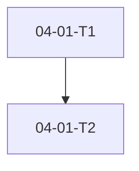

# Phase 4: Plan Phase - Pattern Map

**Mapped:** 2026-05-22
**Files analyzed:** 6
**Analogs found:** 5 / 6

---

## File Classification

| New/Modified File | Role | Data Flow | Closest Analog | Match Quality |
|---|---|---|---|---|
| `mise-en-place/plan-phase/SKILL.md` | workflow skill | event-driven (research + sub-agents + approval gate) | `mise-en-place/spec-phase/SKILL.md` | exact |
| `mise-en-place/tool-validate-plan/validate_plan.py` | implementation script | file-I/O (scan phase dir → exit code) | `mise-en-place/tool-validate-spec/validate_spec.py` | exact |
| `mise-en-place/tool-validate-plan/test_validate_plan.py` | test file | N/A | `mise-en-place/tool-validate-spec/test_validate_spec.py` | exact |
| `mise-en-place/tool-validate-plan/SKILL.md` | tool skill contract | request-response (CLI invocation) | `mise-en-place/tool-validate-spec/SKILL.md` | exact |
| `mise-en-place/plan-phase/test_plan_phase_contract.py` | contract test | N/A | `mise-en-place/spec-phase/test_spec_phase_contract.py` | exact |
| `mise-en-place/README.md` | config/docs | N/A | `mise-en-place/README.md` (self-update pattern) | exact |

---

## Pattern Assignments

### `mise-en-place/plan-phase/SKILL.md` (workflow skill, event-driven)

**Analog:** `mise-en-place/spec-phase/SKILL.md`

**What this file is:** Pure agent orchestration — no Python companion. The agent reads SPEC.md, runs mandatory research, generates PLAN.md files, runs a plan-checker revision loop, and enforces an approval gate. Same document skeleton as spec-phase: front-matter → `cursor_skill_adapter` → `<objective>` → `<process>`.

**Front-matter + cursor_skill_adapter** (copy structure from spec-phase lines 1–28; change `name`/`description` only):

```1:28:mise-en-place/spec-phase/SKILL.md
---
name: spec-phase
description: "Structured deep-questioning flow → .planning/SPEC.md → explicit approval gate"
---

<cursor_skill_adapter>
## A. Skill Invocation
- This skill is invoked when the user mentions `spec-phase` or describes starting a new project spec.
- Treat all user text after the skill mention as `{{GSD_ARGS}}`.
- If no arguments are present, treat `{{GSD_ARGS}}` as empty.

## B. User Prompting
When the workflow needs user input, prompt the user conversationally:
- Present options as a numbered list in your response text
- Ask the user to reply with their choice
- For multi-select, ask for comma-separated numbers

## C. Tool Usage
Use these Cursor tools when executing GSD workflows:
- `Shell` for running commands (terminal operations)
- `StrReplace` for editing existing files
- `Read`, `Write`, `Glob`, `Grep`, `Task`, `WebSearch`, `WebFetch`, `TodoWrite` as needed

## D. Subagent Spawning
When the workflow needs to spawn a subagent:
- Use `Task(subagent_type="generalPurpose", ...)`
- Do NOT pass the `model` parameter — use the Cursor default model
</cursor_skill_adapter>
```

**Entry gate pattern** (adapt spec-phase Step 1 startup + D-20 validate_spec call — plan-phase Step 1 must block on non-zero exit):

```40:44:mise-en-place/spec-phase/SKILL.md
1. Run scaffolding:

```shell
python3 mise-en-place/tool-planning-scaffold/planning_scaffold.py scaffold
```
```

Add immediately after scaffold (new for plan-phase per D-20):

```shell
python3 mise-en-place/tool-validate-spec/validate_spec.py
```

Block workflow if exit code ≠ 0.

**Research sub-agent spawn pattern** (spec-phase Step 3 lines 124–142 — reuse for mandatory pre-plan research per D-21/D-23):

```124:142:mise-en-place/spec-phase/SKILL.md
Before spawning any sub-agent, ensure `.planning/research/` exists (`mkdir -p .planning/research` if Step 1 was skipped).

For each accepted research topic, use the **Task tool** to spawn a `generalPurpose` sub-agent. **Do NOT pass the `model` parameter** — use the Cursor default model.

Sub-agent prompt must include:

- **Topic:** \<the research topic\>
- **Project context:** \<1–2 sentence summary from Q&A answers so far\>
- **Output file:** `.planning/research/RESEARCH-<topic-slug>.md` where topic-slug is lowercased and hyphen-separated (e.g. `stripe-pricing-model`)
- **Path override note (D-04):** CONTEXT.md D-04 originally specified a phase-specific path for research output. That path is non-portable when this skill is replicated to new projects. This skill uses `.planning/research/` instead — portable across all projects.
- **File format:**
  - `# Research: <topic>`
  - `## Summary` — 2–3 sentence executive summary
  - `## Key Findings` — bullets
  - `## Implications for Spec` — how findings shape constraints or success criteria
  - `## Sources` — URLs or descriptions
- **Instruction:** "Keep the file concise — the spec author will read this before writing the final spec."

After each sub-agent completes: Read `.planning/research/RESEARCH-<topic-slug>.md` and note key findings for incorporation into SPEC.md. Multiple research sub-tasks may run; each produces its own file. All are read before the spec is finalized.
```

Plan-phase adaptation: output to `.planning/phases/{slug}/{phase}-RESEARCH.md` (phase artifact home per CONTEXT) OR synthesize from `.planning/research/` — planner consumes research before first PLAN draft.

**Parallel mapper spawn pattern** (map-codebase Step 4 — for mandatory 4-researcher pattern per D-23):

```60:71:mise-en-place/map-codebase/SKILL.md
## Step 4: Parallel mappers

Spawn four `Task(subagent_type="generalPurpose")` mappers in parallel:

| Focus | Output files |
|-------|----------------|
| tech | `STACK.md`, `INTEGRATIONS.md` |
| arch | `ARCHITECTURE.md`, `STRUCTURE.md` |
| quality | `CONVENTIONS.md`, `TESTING.md` |
| concerns | `CONCERNS.md` |

Each prompt must include: focus area, absolute output paths under `.planning/codebase/`, and embedded section outlines below. Sub-agents use the Write tool; orchestrator only confirms completion.
```

**Approval gate pattern** (spec-phase Step 5 lines 205–213 — replicate for approve-all per D-16/D-17/D-18):

```205:213:mise-en-place/spec-phase/SKILL.md
## Step 5: Approval Gate

Per D-08, D-09, SPEC-04 — present the full contents of `.planning/SPEC.md` to the developer.

Ask: **"Approve this spec? Reply with: yes / edit / abort"**

- **yes:** If `status: draft` is present in front-matter, use StrReplace on `.planning/SPEC.md` with `old_string: "status: draft"` and `new_string: "status: approved"`. If already `status: approved` (idempotent): skip the patch. Confirm: "Spec approved ✓ — run /plan-phase to begin planning." Remind: "The plan-phase will verify approval via `python3 mise-en-place/tool-validate-spec/validate_spec.py` before proceeding."
- **edit:** Ask "Which section would you like to revise? (Problem / Who it's for / Constraints / Success Criteria / Out-of-scope / Already Built / To Build)". Return to Q&A for that category. Re-assemble and re-present SPEC.md. Re-prompt approval.
- **abort:** leave status as draft. Confirm: "Spec saved as draft in `.planning/SPEC.md` — resume with /spec-phase." Exit.
```

Plan-phase adaptation: present plan summary + paths; ask "Approve all plans? (yes / edit / abort)"; on **yes** StrReplace `status: draft` → `status: approved` on **every** `{phase}-{NN}-PLAN.md`; remind that exec-phase calls `validate_plan.py`.

**Plan-checker loop** (no mise-en-place analog — orchestration depth from GSD `.cursor/get-shit-done/workflows/plan-phase.md` and CONTEXT D-21/D-22/D-24): spawn `Task(subagent_type="generalPurpose")` plan-checker → write `{phase}-REVIEWS.md` → revise plans → max 3 cycles → escalate to developer.

**PLAN.md output format** (no exact analog — adapt from CONTEXT D-06–D-15, do NOT copy GSD XML tasks from `.planning/phases/03-brownfield-codebase-onboarding/03-01-PLAN.md`):

```yaml
---
status: draft
phase: 04-plan-phase
plan: 01
requirements:
  - PLAN-01
---
```

```markdown
## Objective
...



## Tasks

[PENDING] 04-01-T1 - Create validate_plan.py
  - [ ] Verify: running the script on a valid plan exits 0
  - Depends: (optional)

[PENDING] 04-01-T2 - Add test_validate_plan.py
  - [ ] Verify: pytest passes for approved plan fixture
```

---

### `mise-en-place/tool-validate-plan/validate_plan.py` (implementation script, file-I/O)

**Analog:** `mise-en-place/tool-validate-spec/validate_spec.py`

**Module docstring + exit contract** (lines 1–20 — replicate structure, change domain):

```1:20:mise-en-place/tool-validate-spec/validate_spec.py
#!/usr/bin/env python3
"""
tool-validate-spec — Check that SPEC.md exists, has status: approved, and contains all required section headers.

Exit 0: approved with valid sections.
Exit 1: not approved, missing file, malformed front-matter, or missing section (message to stderr).

Required sections (exact match):
  ## Problem
  ## Who It's For
  ## Constraints
  ## Success Criteria
  ## Out of Scope

Brownfield (project_type: brownfield after normalization):
  ## Already Built
  ## To Build
  Inverse rule: brownfield sections in body require project_type brownfield.
  Dedup: identical bullets in Already Built and To Build are rejected.
"""
```

Plan-phase adaptation: document todo regex, Verify sub-bullet requirement, phase-directory scan, and `status: approved` gate per D-11/D-19.

**Imports + pathlib candidates** (lines 21–29):

```21:29:mise-en-place/tool-validate-spec/validate_spec.py
import pathlib
import re
import sys
from typing import Optional

SPEC_CANDIDATES = [
    pathlib.Path(".planning/SPEC.md"),
    pathlib.Path("SPEC.md"),
]
```

Plan-phase adaptation: accept `--phase-dir` or discover `.planning/phases/*/` containing `*-PLAN.md`; glob `**/*-PLAN.md` within phase directory.

**Reuse `parse_frontmatter` unchanged** (lines 45–63):

```45:63:mise-en-place/tool-validate-spec/validate_spec.py
def parse_frontmatter(text: str) -> dict:
    """Parse YAML-like front-matter between --- markers."""
    if not text.startswith("---"):
        return {}

    end = text.find("\n---", 3)
    if end == -1:
        return {}

    block = text[3:end].strip()
    result = {}
    for line in block.splitlines():
        if not line.strip() or line.lstrip().startswith("#"):
            continue
        if ":" not in line:
            continue
        key, _, value = line.partition(":")
        result[key.strip()] = value.strip()
    return result
```

**Status approval gate** (lines 129–136):

```129:136:mise-en-place/tool-validate-spec/validate_spec.py
    status = fm.get("status", "")
    if status != "approved":
        print(
            f"ERROR: SPEC.md status is '{status}' — must be 'approved' before planning.\n"
            "Run /spec-phase and complete the approval gate.",
            file=sys.stderr,
        )
        sys.exit(1)
```

Plan-phase adaptation: apply to **each** `*-PLAN.md` in the phase directory; fail on first draft plan with actionable path in message.

**Error message pattern** (lines 105–111):

```105:111:mise-en-place/tool-validate-spec/validate_spec.py
    if spec_path is None:
        print(
            "ERROR: SPEC.md not found in .planning/ or project root.\n"
            "Run /spec-phase first to create and approve a spec.",
            file=sys.stderr,
        )
        sys.exit(1)
```

**Success stdout + exit 0** (lines 173–177):

```173:177:mise-en-place/tool-validate-spec/validate_spec.py
    msg = f"✓ SPEC.md approved (version {fm.get('version', '?')}, {fm.get('date', '?')})"
    if project_type == "brownfield":
        msg += " [brownfield]"
    print(msg)
    sys.exit(0)
```

Plan-phase adaptation: e.g. `✓ 2 plan(s) approved in .planning/phases/04-plan-phase/`.

**New validation logic** (no analog — implement per CONTEXT D-06/D-09/D-11):

```python
TASK_LINE_RE = re.compile(
    r"^\[(PENDING|IN_PROGRESS|DONE)\]\s+(\d{2}-\d{2}-T\d+)\s+-\s+.+"
)
VERIFY_LINE_RE = re.compile(r"^\s+-\s+\[\s*\]\s+Verify:\s+.+")
```

For each plan file: require ≥1 `TASK_LINE_RE` match; for each task line, require at least one following `VERIFY_LINE_RE` before the next task or EOF. Presence-only check — no atomicity sizing (D-05).

**Main guard** (lines 180–181):

```180:181:mise-en-place/tool-validate-spec/validate_spec.py
if __name__ == "__main__":
    main()
```

---

### `mise-en-place/tool-validate-plan/test_validate_plan.py` (test file)

**Analog:** `mise-en-place/tool-validate-spec/test_validate_spec.py`

**Test module setup** (lines 1–9):

```1:9:mise-en-place/tool-validate-spec/test_validate_spec.py
"""Tests for validate_spec.py"""
import sys
from pathlib import Path

import pytest

sys.path.insert(0, str(Path(__file__).parent))
```

**Fixture helper pattern** (lines 18–25 — build minimal valid artifact in tmp_path):

```18:25:mise-en-place/tool-validate-spec/test_validate_spec.py
def _spec_body(include_sections=None):
    sections = include_sections if include_sections is not None else CANONICAL_SECTIONS
    lines = ["---", "status: approved", "version: 1", "date: 2026-05-22", "---", ""]
    for header in sections:
        lines.append(header)
        lines.append("Placeholder content.")
        lines.append("")
    return "\n".join(lines)
```

Plan-phase `_plan_body()` should emit:

```markdown
---
status: approved
phase: 04-plan-phase
plan: 01
requirements:
  - PLAN-01
---

## Objective
Test plan.

## Tasks

[PENDING] 04-01-T1 - Example task
  - [ ] Verify: observable outcome
```

**Happy-path exit 0 test** (lines 28–39):

```28:39:mise-en-place/tool-validate-spec/test_validate_spec.py
def test_approved_spec_exits_zero(tmp_path, monkeypatch):
    """Approved SPEC.md with all sections exits 0."""
    monkeypatch.chdir(tmp_path)
    planning = tmp_path / ".planning"
    planning.mkdir()
    (planning / "SPEC.md").write_text(_spec_body(), encoding="utf-8")

    from validate_spec import main

    with pytest.raises(SystemExit) as exc_info:
        main()
    assert exc_info.value.code == 0
```

**Draft status exits 1** (lines 42–55):

```42:55:mise-en-place/tool-validate-spec/test_validate_spec.py
def test_draft_spec_exits_one(tmp_path, monkeypatch, capsys):
    """Draft status exits 1 with actionable stderr."""
    monkeypatch.chdir(tmp_path)
    planning = tmp_path / ".planning"
    planning.mkdir()
    content = _spec_body().replace("status: approved", "status: draft")
    (planning / "SPEC.md").write_text(content, encoding="utf-8")

    from validate_spec import main

    with pytest.raises(SystemExit) as exc_info:
        main()
    assert exc_info.value.code == 1
    assert "must be 'approved'" in capsys.readouterr().err
```

**Additional tests to add** (mirror validate_spec coverage):

| Test | Assert |
|---|---|
| `test_missing_verify_subbullet_exits_one` | Task line without `Verify:` → exit 1 |
| `test_no_tasks_exits_one` | Plan with no `[STATUS] TASKID` lines → exit 1 |
| `test_malformed_frontmatter_exits_one` | No `---` block → exit 1 |
| `test_any_draft_plan_in_phase_exits_one` | Two plans, one draft → exit 1 |
| `test_all_approved_valid_plans_exits_zero` | Multiple approved plans with tasks → exit 0 |

---

### `mise-en-place/tool-validate-plan/SKILL.md` (tool skill contract, request-response)

**Analog:** `mise-en-place/tool-validate-spec/SKILL.md`

**Complete structure** (45 lines — replicate verbatim adapter block; change name, description, objective, process):

```1:32:mise-en-place/tool-validate-spec/SKILL.md
---
name: tool-validate-spec
description: "Check that SPEC.md exists, has status: approved, and contains all required sections before planning begins"
---

<cursor_skill_adapter>
## A. Skill Invocation
- This skill is invoked when the user mentions `tool-validate-spec` or describes a task matching this skill.
- Treat all user text after the skill mention as `{{GSD_ARGS}}`.
- If no arguments are present, treat `{{GSD_ARGS}}` as empty.

## B. User Prompting
When the workflow needs user input, prompt the user conversationally:
- Present options as a numbered list in your response text
- Ask the user to reply with their choice
- For multi-select, ask for comma-separated numbers

## C. Tool Usage
Use these Cursor tools when executing GSD workflows:
- `Shell` for running commands (terminal operations)
- `StrReplace` for editing existing files
- `Read`, `Write`, `Glob`, `Grep`, `Task`, `WebSearch`, `WebFetch`, `TodoWrite` as needed

## D. Subagent Spawning
When the workflow needs to spawn a subagent:
- Use `Task(subagent_type="generalPurpose", ...)`
- The `model` parameter maps to Cursor's model options (e.g., "fast")
</cursor_skill_adapter>

<objective>
Verify that `.planning/SPEC.md` exists, has `status: approved`, and contains all five required section headers. Exits 0 on success, exits 1 with an actionable error message on any failure.
</objective>
```

**Exit code contract table** (lines 34–71 — same markdown table format):

```34:44:mise-en-place/tool-validate-spec/SKILL.md
<process>
Run from the project root:

```shell
python3 mise-en-place/tool-validate-spec/validate_spec.py
```

**Exit code contract:**

- **Exit 0** — SPEC.md found, `status: approved`, and all required section headers present.
- **Exit 1** — Any failure: SPEC.md missing, malformed front-matter, status not yet approved, or missing required section header.
```

Plan-phase SKILL.md changes:
- Invocation: `python3 mise-en-place/tool-validate-plan/validate_plan.py [--phase-dir PATH]`
- Document todo format regex and Verify sub-bullet requirement
- **When to invoke:** plan-phase approval gate confirmation; exec-phase (Phase 5) before dispatch (D-19)
- Failure table rows: draft plan, missing tasks, task without Verify line

---

### `mise-en-place/plan-phase/test_plan_phase_contract.py` (contract test)

**Analog:** `mise-en-place/spec-phase/test_spec_phase_contract.py`

**Module + SKILL path constant** (lines 1–5):

```1:5:mise-en-place/spec-phase/test_spec_phase_contract.py
"""Contract tests for spec-phase/SKILL.md workflow structure."""
from pathlib import Path

SKILL = Path(__file__).parent / "SKILL.md"
```

**Step ordering assertion** (lines 25–27):

```25:27:mise-en-place/spec-phase/test_spec_phase_contract.py
def test_step_1_4_after_scaffold_before_qa():
    text = SKILL.read_text(encoding="utf-8")
    assert text.find("## Step 1:") < text.find("Step 1.4") < text.find("## Step 2:")
```

Plan-phase contract tests to add:

| Test | Assert in SKILL.md |
|---|---|
| `test_validate_spec_entry_gate_documented` | `validate_spec.py` invoked in Step 1 |
| `test_validate_plan_belt_and_suspenders_documented` | `validate_plan.py` referenced at approval / exec handoff |
| `test_mandatory_research_before_plan` | Research step precedes plan generation |
| `test_plan_checker_revision_loop` | `{phase}-REVIEWS.md` and max 3 cycles |
| `test_approval_gate_yes_edit_abort` | `yes / edit / abort` prompt |
| `test_approve_all_strreplace` | `status: draft` → `status: approved` on all plans |
| `test_todo_task_format_documented` | `[PENDING]` and `04-01-T1` example or TASKID pattern |
| `test_verify_subbullet_documented` | `Verify:` nested checkbox |
| `test_mermaid_after_objective` | Mermaid graph placement after `## Objective` |
| `test_no_model_param_on_subagents` | `Do NOT pass the \`model\` parameter` |

**Tool invocation contract test** (lines 44–46):

```44:46:mise-en-place/spec-phase/test_spec_phase_contract.py
def test_detect_brownfield_invocation_documented():
    text = SKILL.read_text(encoding="utf-8")
    assert "tool-detect-brownfield" in text or "detect_brownfield.py" in text
```

---

### `mise-en-place/README.md` (config/docs)

**Analog:** `mise-en-place/README.md` (existing tool catalog entries)

**Tool section pattern** (tool-validate-spec block lines 19–25 — replicate for tool-validate-plan):

```19:25:mise-en-place/README.md
### tool-validate-spec

Validates that `.planning/SPEC.md` exists, has `status: approved`, and contains all five required section headers before planning begins. When `project_type: brownfield`, also requires `## Already Built` and `## To Build`, rejects brownfield sections without matching frontmatter (inverse rule), and rejects identical bullets across those sections (dedup). Agent reads `tool-validate-spec/SKILL.md` for invocation contract.

```shell
python3 mise-en-place/tool-validate-spec/validate_spec.py
```
```

**Workflow skill section pattern** (spec-phase block lines 47–51):

```47:51:mise-en-place/README.md
### spec-phase

Structured deep-questioning workflow from an empty or existing repo to an explicitly approved SPEC.md. Step 1.4 runs brownfield detection and completeness-aware mapping before Q&A when code exists. Brownfield specs add `## Already Built` and `## To Build` with `project_type: brownfield`. Agent reads `spec-phase/SKILL.md` — no Python script (workflow skill only).

Invoked via `/spec-phase` or by mentioning spec-phase in conversation.
```

Add parallel entries for `tool-validate-plan` and `plan-phase`. Update contract test command (lines 71–75) to include `plan-phase/test_plan_phase_contract.py`.

---

## Shared Patterns

### Skill + Tool Pairing (Phase 2 established)
**Source:** CONTEXT code_context + `mise-en-place/spec-phase/` + `mise-en-place/tool-validate-spec/`
**Apply to:** `plan-phase/SKILL.md` + `tool-validate-plan/`

Workflow skill orchestrates; validation tool enforces belt-and-suspenders at approval and exec entry.

### Python Stdlib-Only + Exit Code Contract
**Source:** `.planning/phases/01-tooling-foundation/01-CONTEXT.md` D-01, D-09
**Apply to:** `validate_plan.py`

```python
# Exit 0 = success (stdout confirmation)
# Exit 1 = failure (ERROR: prefix to stderr, actionable message)
```

### Front-Matter Parser (reuse, do not reimplement)
**Source:** `mise-en-place/tool-validate-spec/validate_spec.py:45-63`
**Apply to:** `validate_plan.py`

Import or copy `parse_frontmatter` identically — both tools parse flat YAML between `---` markers.

### Approval Gate (StrReplace draft → approved)
**Source:** `mise-en-place/spec-phase/SKILL.md:211`
**Apply to:** `plan-phase/SKILL.md` approve-all step

```211:211:mise-en-place/spec-phase/SKILL.md
- **yes:** If `status: draft` is present in front-matter, use StrReplace on `.planning/SPEC.md` with `old_string: "status: draft"` and `new_string: "status: approved"`. If already `status: approved` (idempotent): skip the patch. Confirm: "Spec approved ✓ — run /plan-phase to begin planning." Remind: "The plan-phase will verify approval via `python3 mise-en-place/tool-validate-spec/validate_spec.py` before proceeding."
```

### Sub-Agent Spawning (no model param)
**Source:** `mise-en-place/spec-phase/SKILL.md:126-127`, `mise-en-place/map-codebase/SKILL.md:62`
**Apply to:** research sub-agents, plan-checker sub-agent

```126:127:mise-en-place/spec-phase/SKILL.md
For each accepted research topic, use the **Task tool** to spawn a `generalPurpose` sub-agent. **Do NOT pass the `model` parameter** — use the Cursor default model.
```

### Phase Artifact Paths
**Source:** CONTEXT D-22, canonical_refs
**Apply to:** all plan-phase outputs

| Artifact | Path |
|---|---|
| Research | `.planning/phases/{slug}/{phase}-RESEARCH.md` |
| Plans | `.planning/phases/{slug}/{phase}-{NN}-PLAN.md` |
| Reviews | `.planning/phases/{slug}/{phase}-REVIEWS.md` |

### pytest Test Conventions
**Source:** `mise-en-place/tool-validate-spec/test_validate_spec.py`
**Apply to:** `test_validate_plan.py`, `test_plan_phase_contract.py`

- `tmp_path` + `monkeypatch.chdir(tmp_path)` for isolation
- `pytest.raises(SystemExit)` for exit code assertions
- `capsys.readouterr().err` for stderr message checks
- Helper functions `_plan_body()` / `_spec_body()` for fixture construction
- Descriptive docstrings on each test function

---

## No Analog Found

| File / Concern | Role | Data Flow | Reason |
|---|---|---|---|
| Todo-format PLAN.md body (output artifact) | plan document | transform | Prior GSD plans use `<task>` XML and heavy frontmatter (see `03-01-PLAN.md` lines 1–69); Phase 4 uses lighter todo format per D-06/D-15 — define from CONTEXT, validate with new script |
| Plan-checker review dimensions | workflow sub-step | event-driven | GSD `gsd-plan-checker` agent exists in `.cursor/agents/` but no mise-en-place equivalent; plan-phase uses `generalPurpose` Task sub-agent per D-22 |
| Split-preview conversational flow | workflow step | event-driven | No prior skill documents split-preview; implement from CONTEXT D-01–D-04 only |

---

## Metadata

**Analog search scope:** `mise-en-place/`, `.planning/phases/02-spec-phase-greenfield/`, `.planning/phases/03-brownfield-codebase-onboarding/`, `.cursor/get-shit-done/workflows/plan-phase.md` (orchestration reference only)
**Files scanned:** 18
**Pattern extraction date:** 2026-05-22
