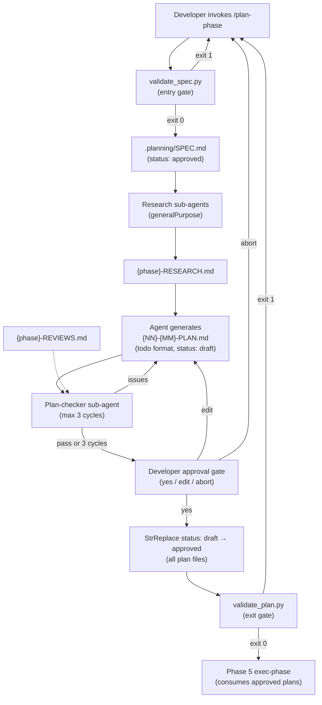
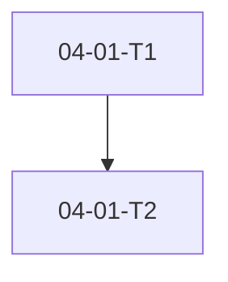

# Phase 4: Plan Phase - Research

**Researched:** 2026-05-22
**Domain:** Cursor skill orchestration, Python stdlib plan validation, todo-format PLAN.md contract, research + plan-checker revision loops
**Confidence:** HIGH — locked decisions in CONTEXT.md are exhaustive; patterns verified from Phases 1–3 codebase; GSD reference material cross-checked

---

<user_constraints>
## User Constraints (from CONTEXT.md)

### Locked Decisions

#### Plan Decomposition
- **D-01:** Single plan by default — one `{phase}-01-PLAN.md` unless the developer explicitly requests multiple streams.
- **D-02:** Split trigger is conversational — developer says "split into X and Y" or "two parallel plans" during plan-phase (no required CLI flag in MVP).
- **D-03:** Parallel plans must have no cross-plan `depends_on` — shared or blocking work belongs in a prior-wave plan, not split across parallel streams.
- **D-04:** Before writing any PLAN.md on a split, agent previews proposed plan names, scope per stream, and wave assignment; developer confirms first.

#### Atomic Task Contract
- **D-05:** Structured-soft enforcement — SKILL.md requires verification criteria per task; `tool-validate-plan` checks presence only, not atomicity count or sizing.
- **D-06:** Task format is markdown todos: `[STATUS] TASKID - Title` (not GSD `<task>` XML blocks).
- **D-07:** TASKID scheme: `{plan}-{task}` — e.g. `04-01-T1`, `04-01-T2` within plan `04-01`.
- **D-08:** STATUS uses text tags: `[PENDING]`, `[IN_PROGRESS]`, `[DONE]` (not checkbox-only `[ ]` / `[x]`).
- **D-09:** Verification criteria are nested checkbox sub-bullets under each task: `  - [ ] Verify: <single observable outcome>`.
- **D-10:** Task sizing: one file or one script per task — e.g. "create validate_plan.py" is one task; script + tests are two.
- **D-11:** `tool-validate-plan` checks: plan has ≥1 todo line matching `[STATUS] TASKID` pattern and each task has a `Verify:` sub-bullet.
- **D-12:** Task dependencies expressed two ways: (a) `Depends: {TASKID}` sub-bullet under the task; (b) Mermaid dependency graph at plan top.
- **D-13:** Mermaid graph placement: immediately after `## Objective`, before the task list.
- **D-14:** All tasks written as `[PENDING]` at plan creation; execute-phase updates status.
- **D-15:** Minimal YAML frontmatter per PLAN.md: `status`, `phase`, `plan`, `requirements[]` only — lighter than full GSD frontmatter from Phases 1–3.

#### Approval Gate
- **D-16:** Hybrid gate — all plans written as `status: draft`; agent presents summary; single "approve all" confirmation flips every plan to `status: approved`.
- **D-17:** In-flow approval mirrors spec-phase (Phase 2 D-08): present plan content (or summary + paths), ask "Approve? (yes / edit / abort)".
- **D-18:** `status: draft | approved` lives in each PLAN.md YAML frontmatter; approve-all runs StrReplace `status: draft` → `status: approved` on every plan file.
- **D-19:** Belt-and-suspenders: `tool-validate-plan` exits non-zero if ANY plan in the phase directory is not approved or fails todo-format checks; exec-phase (Phase 5) must call it before dispatch.
- **D-20:** Entry gate (deferred from Phase 2): plan-phase startup MUST call `python3 mise-en-place/tool-validate-spec/validate_spec.py` and block if spec is not approved.

#### Plan-Phase Orchestration Depth
- **D-21:** Full loop — mandatory research → generate plan(s) → plan-checker sub-agent review → revise up to 3 cycles → present to developer for approval gate.
- **D-22:** Plan-checker runs as a Task sub-agent (`generalPurpose`, fresh context); writes review to `{phase}-REVIEWS.md`.
- **D-23:** Mandatory research before first plan draft — spawn researcher sub-agents (GSD 4-researcher pattern); research output feeds planner.
- **D-24:** Max 3 plan-checker revision cycles; escalate unresolved issues to developer (same cap as GSD plan-checker).

### Claude's Discretion
- Exact wording of split-preview and approval prompts.
- Research topic selection when spawning mandatory researchers.
- Plan-checker review dimensions (within the 3-cycle cap).
- Heuristic for when agent should proactively suggest a split vs. stay single-plan.

### Deferred Ideas (OUT OF SCOPE)
None — discussion stayed within phase scope.
</user_constraints>

---

<phase_requirements>
## Phase Requirements

| ID | Description | Research Support |
|----|-------------|------------------|
| PLAN-01 | User can initiate a plan phase that reads the approved spec and produces one or more executable task plans | `plan-phase/SKILL.md` Step 1 entry gate (`validate_spec.py`) + Step 4 plan generation writing `{NN}-{MM}-PLAN.md` under `.planning/phases/{slug}/` |
| PLAN-02 | Each plan decomposes into atomic tasks — each task has a single, clear, verifiable deliverable | D-06–D-10 task contract in SKILL.md; D-11 `validate_plan.py` enforces todo + `Verify:` presence |
| PLAN-03 | Plan phase supports generating multiple parallel plans for independent work streams | D-01–D-04 split-preview flow; D-03 no cross-plan deps; wave assignment in split preview |
| PLAN-04 | Plan must be explicitly approved by the user before execution begins | D-16–D-19 hybrid approve-all gate + `validate_plan.py` belt-and-suspenders |
| PLAN-05 | Plan phase works on a clean context — uses only the spec file and local project files | SKILL.md startup reads `.planning/SPEC.md`, `.planning/codebase/*`, `.planning/research/*` via Read/Shell only; no session-state dependency |
</phase_requirements>

---

## Summary

Phase 4 delivers the second major pipeline stage: **`/plan-phase`** transforms an approved `.planning/SPEC.md` into one or more **todo-format PLAN.md files** under `.planning/phases/{slug}/`, behind mandatory research, a bounded plan-checker revision loop, and an explicit approval gate. The implementation follows the established **skill + tool pairing** from Phase 2: `mise-en-place/plan-phase/SKILL.md` (orchestration only, no Python script) and `mise-en-place/tool-validate-plan/validate_plan.py` (stdlib-only exit-code gate).

**Critical format distinction:** End-user plans produced by `/plan-phase` use the **lightweight todo markdown format** (D-06/D-15) — NOT the GSD `<task>` XML blocks used in Phases 1–3 execution plans. Phase 4's own implementation plans (what the planner writes to build this phase) continue using standard GSD PLAN format like `02-01-PLAN.md`. The planner must not conflate these two formats.

The orchestration depth mirrors GSD's `/gsd-plan-phase` loop `[CITED: research/frameworks/gsd.md]` — research → planner → plan-checker (max 3×) → approval — but adapts sub-agent spawning to the cookbook's Cursor-native pattern: `Task(subagent_type="generalPurpose")` without a `model` parameter, matching `spec-phase/SKILL.md` `[VERIFIED: codebase]`.

**Primary recommendation:** Ship Wave 1 as TDD for `validate_plan.py` (mirror `02-01-PLAN.md`), Wave 2 as `plan-phase/SKILL.md` + `tool-validate-plan/SKILL.md` + contract tests + README (mirror `02-02-PLAN.md`). Reuse `parse_frontmatter()` from `validate_spec.py` verbatim — same three-key parser pattern, extended for plan-specific fields.

---

## Architectural Responsibility Map

| Capability | Primary Tier | Secondary Tier | Rationale |
|------------|-------------|----------------|-----------|
| Spec approval entry gate | Python (`validate_spec.py`) | Agent instruction | D-20 belt-and-suspenders; deterministic exit code before orchestration begins |
| Mandatory domain research | Sub-agent (`generalPurpose` via Task) | — | D-23; fresh context per topic; writes `{phase}-RESEARCH.md` |
| Plan generation (todo format) | Agent (SKILL.md + Write tool) | — | Conversational decomposition + file writes are agent-native |
| Plan-checker revision loop | Sub-agent (`generalPurpose` via Task) | Agent orchestrator | D-22; writes `{phase}-REVIEWS.md`; orchestrator applies revisions |
| Split preview / confirmation | Agent (conversation) | — | D-04 requires developer confirm before multi-plan write |
| In-flow approval gate | Agent (StrReplace on frontmatter) | — | D-17 mirrors spec-phase D-08 pattern |
| Plan format + approval validation | Python (`validate_plan.py`) | Agent instruction | D-19; exec-phase calls script before dispatch |
| `.planning/phases/` I/O | Agent (Write/Read) or `planning_scaffold.py write-artifact` | — | Phase artifact home per PROJECT.md file-based state |
| Mermaid dependency graph | Agent (inline in PLAN.md) | — | D-12/D-13; visual only — not validated by Python in MVP |
| Wave / parallel assignment | Agent (SKILL.md logic) | — | D-03; no cross-plan deps enforced in SKILL, not in validator |

---

## Standard Stack

### Core

| Component | Version/Form | Purpose | Why Standard |
|-----------|-------------|---------|--------------|
| `plan-phase/SKILL.md` | Markdown agent contract | Full orchestration workflow | Established Phase 2 pattern: workflow = SKILL only `[VERIFIED: codebase]` |
| `validate_plan.py` | Python 3.9+ stdlib-only | Todo-format + approval gate | D-05/D-11; mirrors `validate_spec.py` exit contract `[VERIFIED: codebase]` |
| `parse_frontmatter()` | Copied from validate_spec | YAML-like frontmatter parsing | Proven in Phase 2/3; no `yaml` pip dep `[VERIFIED: codebase]` |
| `pathlib` + `re` + `sys` + `argparse` | stdlib | File discovery, regex, CLI | All Phase 1–3 tools use these `[VERIFIED: codebase]` |
| `Task(subagent_type="generalPurpose")` | Cursor native | Research + plan-checker spawn | spec-phase research pattern `[VERIFIED: codebase]` |
| `test_plan_phase_contract.py` | pytest | SKILL.md structure contract | spec-phase contract test pattern `[VERIFIED: codebase]` |

### Supporting

| Component | Version/Form | Purpose | When to Use |
|-----------|-------------|---------|-------------|
| `planning_scaffold.py write-artifact` | Existing Phase 1 tool | Write PLAN.md under `.planning/` | Optional; Write tool is sufficient for MVP |
| `validate_spec.py` | Existing Phase 2 tool | Entry gate before plan-phase | Every plan-phase invocation (D-20) |
| GSD `gsd-plan-checker` reference | `.cursor/agents/gsd-plan-checker.md` | Review dimension inspiration | Plan-checker prompt template only — cookbook uses `generalPurpose`, not GSD agent file |

### Alternatives Considered

| Instead of | Could Use | Tradeoff |
|------------|-----------|----------|
| Todo markdown format (D-06) | GSD `<task>` XML | GSD format is heavier; locked decision rejects this for end-user plans |
| `generalPurpose` sub-agents | Dedicated `.cursor/agents/plan-checker.md` | Adds agent file maintenance; deferred — D-22 specifies generalPurpose |
| Single-plan default (D-01) | Always multi-plan | Over-splits small phases; locked decision rejects |
| Strict atomicity validator | Presence-only checks (D-11) | Strict sizing requires NLP/heuristics; soft enforcement in SKILL is sufficient for MVP |

**Installation:** None — Python stdlib only. pytest is dev-only (same as Phases 1–3).

**Version verification:**
```bash
python3 --version   # 3.9.6 on research machine [VERIFIED: environment]
python3 -m pytest --version  # 8.4.2 [VERIFIED: environment]
```

---

## Package Legitimacy Audit

> Phase 4 installs **no external runtime packages**. All tooling is Python stdlib. pytest is dev-only and already used project-wide.

| Package | Registry | Age | Downloads | Source Repo | slopcheck | Disposition |
|---------|----------|-----|-----------|-------------|-----------|-------------|
| *(none)* | — | — | — | — | — | N/A — stdlib only |

**Packages removed due to slopcheck [SLOP] verdict:** none (slopcheck not run — no packages to audit)
**Packages flagged as suspicious [SUS]:** none

*No pip installs in this phase. Planner must not add dependencies without explicit approval.*

---

## Architecture Patterns

### System Architecture Diagram



### Recommended Project Structure

```
mise-en-place/
├── plan-phase/
│   ├── SKILL.md                      # Orchestration workflow (new)
│   └── test_plan_phase_contract.py   # SKILL structure contract tests (new)
├── tool-validate-plan/
│   ├── SKILL.md                      # Invocation contract (new)
│   ├── validate_plan.py              # Stdlib validator (new)
│   └── test_validate_plan.py         # pytest TDD suite (new)
└── README.md                         # Document new tools (update)

.planning/phases/{slug}/                # End-user plan outputs
├── {phase}-CONTEXT.md                  # From discuss-phase (input)
├── {phase}-RESEARCH.md                 # Mandatory research output
├── {phase}-01-PLAN.md                  # Todo-format plan(s)
├── {phase}-02-PLAN.md                  # Optional parallel plan
└── {phase}-REVIEWS.md                  # Plan-checker output
```

### Pattern 1: Skill + Tool Pairing (Phase 2 Mirror)

**What:** Workflow skill owns orchestration; companion Python tool owns deterministic validation with exit codes.
**When to use:** Any phase gate that must block downstream commands programmatically.
**Example:**

```python
# Source: mise-en-place/tool-validate-spec/validate_spec.py [VERIFIED: codebase]
def parse_frontmatter(text: str) -> dict:
    if not text.startswith("---"):
        return {}
    end = text.find("\n---", 3)
    if end == -1:
        return {}
    block = text[3:end].strip()
    result = {}
    for line in block.splitlines():
        if not line.strip() or line.lstrip().startswith("#"):
            continue
        if ":" not in line:
            continue
        key, _, value = line.partition(":")
        result[key.strip()] = value.strip()
    return result
```

### Pattern 2: End-User Todo PLAN.md Template

**What:** Lightweight plan format distinct from GSD execution plans.
**When to use:** All outputs from `/plan-phase` skill.
**Example:**

```markdown
---
status: draft
phase: 04-example-feature
plan: 01
requirements:
  - PLAN-01
  - PLAN-02
---

## Objective

Transform approved spec into working validation tooling.



## Tasks

[PENDING] 04-01-T1 - Create validate_plan.py with todo-pattern parser
  - [ ] Verify: `python3 validate_plan.py --phase-dir fixtures/approved` exits 0 on valid plan
  - Depends: (none)

[PENDING] 04-01-T2 - Add test_validate_plan.py with RED cases for draft status
  - [ ] Verify: `python3 -m pytest tool-validate-plan/ -x -q` exits 0
  - Depends: 04-01-T1
```

### Pattern 3: Plan-Checker Revision Loop

**What:** Bounded quality loop before developer approval.
**When to use:** After first plan draft, before approval gate (D-21/D-24).
**Flow:** `[CITED: research/frameworks/gsd.md]` — spawn checker → parse `{phase}-REVIEWS.md` for BLOCKER/WARNING → revise plans → repeat (max 3) → escalate to developer if unresolved.

**Plan-checker sub-agent prompt must include:**
- Phase goal from SPEC.md Success Criteria
- Locked decisions from `{phase}-CONTEXT.md` (if exists)
- All draft PLAN.md file paths
- Output path: `{phase}-REVIEWS.md`
- Instruction: classify issues as BLOCKER or WARNING; end with `## VERIFICATION PASSED` or `## ISSUES FOUND`

### Pattern 4: Mandatory Research Before Planning

**What:** Research sub-agents produce `{phase}-RESEARCH.md` before any PLAN.md is written.
**When to use:** Every plan-phase invocation (D-23); not optional.
**Adaptation from GSD:** GSD spawns 4 parallel researchers (stack/features/architecture/pitfalls) `[CITED: research/frameworks/gsd.md]`. Cookbook uses topic selection at agent discretion but must produce at least one `{phase}-RESEARCH.md` synthesizing findings. Recommend 1–3 parallel `generalPurpose` researchers on topics derived from SPEC.md constraints and Success Criteria, then agent synthesizes/writes consolidated `{phase}-RESEARCH.md`.

### Anti-Patterns to Avoid

- **Using GSD `<task>` XML in end-user plans:** Violates D-06; exec-phase will expect todo format.
- **Using todo format for Phase 4 execution plans:** Phase 4's own PLAN.md files (04-01, 04-02) must use GSD format for gsd-executor compatibility.
- **Validating atomicity in Python:** D-11 is presence-only; do not build NLP task-size checker in MVP.
- **Cross-plan depends_on in parallel streams:** Violates D-03; plan-checker should flag.
- **Skipping validate_spec.py on startup:** D-20 explicitly deferred from Phase 2 — must wire now.
- **Per-plan approval:** D-16 requires approve-all, not per-file confirmation.

---

## Don't Hand-Roll

| Problem | Don't Build | Use Instead | Why |
|---------|-------------|-------------|-----|
| YAML frontmatter parsing | Custom regex parser from scratch | Copy `parse_frontmatter()` from validate_spec.py | Proven, tested, same schema family |
| `.planning/` directory creation | Manual mkdir in SKILL only | `planning_scaffold.py scaffold` at startup | Idempotent, path-validated, tested |
| Spec approval check | Agent reads status field only | `validate_spec.py` | D-20; deterministic exit code |
| Plan approval check | Agent reads status field only | `validate_plan.py` | D-19; exec-phase depends on this |
| Full plan-checker agent file | New `.cursor/agents/` definition | `Task(generalPurpose)` with structured prompt | D-22; matches spec-phase research pattern |
| Mermaid rendering/validation | Mermaid CLI or parser | Agent writes raw mermaid block; no Python validation in MVP | D-11 does not require graph validation |
| Wave dependency analysis engine | Graph solver in Python | Agent assigns wave in frontmatter at plan creation; exec-phase reads it | Matches Phase 3 pattern; D-03 enforced in SKILL |

**Key insight:** Phase 4's value is orchestration discipline (research → check → approve), not novel parsing algorithms. Reuse Phase 2's validation architecture wholesale.

---

## Common Pitfalls

### Pitfall 1: Conflating Two PLAN Formats

**What goes wrong:** Planner writes Phase 4 execution plans in todo format, or writes end-user plans in GSD XML.
**Why it happens:** Both are named PLAN.md; GSD format is dominant in `.planning/phases/01-03/`.
**How to avoid:** RESEARCH and CONTEXT explicitly label "end-user format" vs "execution format". Execution plans keep GSD frontmatter (`phase`, `plan`, `type`, `wave`, `depends_on`, `must_haves`, `<tasks>`).
**Warning signs:** Plan-checker sees `<task type="auto">` in a todo-format plan, or `[PENDING] 04-01-T1` in a gsd-executor plan.

### Pitfall 2: validate_plan.py Scope Creep

**What goes wrong:** Validator checks Mermaid syntax, task atomicity, wave assignment, or cross-plan deps.
**Why it happens:** ROADMAP success criteria mention atomic tasks and parallel streams.
**How to avoid:** D-11 locks scope: todo pattern + Verify sub-bullet + status approved. Atomicity is SKILL-soft (D-05/D-10).
**Warning signs:** Test cases for "multi-file task rejected" or "invalid mermaid exits 1".

### Pitfall 3: Missing Verify Sub-Bullet Association

**What goes wrong:** Regex finds tasks but misses that a Verify line belongs to the wrong task or is absent for some tasks.
**Why it happens:** Nested markdown structure under todo lines.
**How to avoid:** Parse linearly: on task line match, scan subsequent indented lines until next task line or `##` header; require at least one line matching `Verify:` in that block.
**Warning signs:** Plan with Verify block only at file end passes validation.

### Pitfall 4: Approve-All Incomplete

**What goes wrong:** Agent approves one plan file but leaves others as draft; exec-phase blocked unexpectedly.
**Why it happens:** Multi-plan splits (D-02/D-04).
**How to avoid:** Approval step must glob all `*-PLAN.md` in phase dir and StrReplace each; confirm count to developer.
**Warning signs:** `validate_plan.py` fails with "plan 04-02-PLAN.md status is draft" after user said yes.

### Pitfall 5: Research Skipped for "Simple" Specs

**What goes wrong:** Agent writes plans directly from SPEC.md without RESEARCH.md.
**Why it happens:** Small specs feel sufficient; D-23 is mandatory regardless.
**How to avoid:** Contract test asserts SKILL.md contains "mandatory research" and RESEARCH.md write step before plan generation.
**Warning signs:** No `{phase}-RESEARCH.md` in phase directory after plan-phase completes.

### Pitfall 6: Phase Directory Discovery

**What goes wrong:** `validate_plan.py` doesn't know which `.planning/phases/*/` to scan.
**Why it happens:** Unlike SPEC.md (single canonical path), plans live per-phase.
**How to avoid:** Require `--phase-dir` CLI argument (required); SKILL.md derives path from spec/project context. Document in tool-validate-plan/SKILL.md.
**Warning signs:** Script scans all phases or CWD incorrectly.

---

## Code Examples

### validate_plan.py — Task Line Regex

```python
# Source: derived from D-06/D-07/D-08 locked decisions
import re

TASK_LINE = re.compile(
    r"^\[(PENDING|IN_PROGRESS|DONE)\]\s+(\S+)\s+-\s+(.+)$"
)
VERIFY_LINE = re.compile(r"^\s+-\s+\[\s*\]\s+Verify:\s+.+")

def iter_tasks(body: str):
    """Yield (lineno, status, task_id, title) for each task line."""
    for i, line in enumerate(body.splitlines(), start=1):
        m = TASK_LINE.match(line)
        if m:
            yield i, m.group(1), m.group(2), m.group(3)
```

### validate_plan.py — Verify Block Scan

```python
# Source: D-09/D-11 presence check pattern
def task_has_verify(body_lines: list[str], task_index: int) -> bool:
    """Check indented lines after task_index until next task or section header."""
    for line in body_lines[task_index + 1:]:
        if TASK_LINE.match(line) or line.startswith("## "):
            break
        if "Verify:" in line:
            return True
    return False
```

### validate_plan.py — CLI Interface (Recommended)

```python
# Source: planning_scaffold.py _validate_root pattern [VERIFIED: codebase]
# argparse subcommand or required --phase-dir
# Usage: python3 mise-en-place/tool-validate-plan/validate_plan.py --phase-dir .planning/phases/04-plan-phase
```

### plan-phase/SKILL.md — Entry Gate (D-20)

```shell
# Source: spec-phase/SKILL.md Step 5 + 04-CONTEXT D-20
python3 mise-en-place/tool-validate-spec/validate_spec.py
# Exit non-zero → STOP with stderr message; do not proceed
```

### Contract Test Pattern

```python
# Source: mise-en-place/spec-phase/test_spec_phase_contract.py [VERIFIED: codebase]
def test_entry_gate_calls_validate_spec():
    text = SKILL.read_text(encoding="utf-8")
    assert "validate_spec.py" in text
    assert "validate_plan.py" in text  # exit gate documented for exec-phase handoff
```

---

## State of the Art

| Old Approach | Current Approach | When Changed | Impact |
|--------------|------------------|--------------|--------|
| Plan-phase deferred validate_spec wiring | D-20 mandates entry gate at plan-phase startup | Phase 4 CONTEXT 2026-05-22 | Closes Phase 2 D-09 gap |
| GSD XML tasks for all plans | Todo markdown for end-user plans only | Phase 4 D-06 | Lighter scanability; exec-phase must parse new format |
| Optional research | Mandatory research (D-23) | Phase 4 CONTEXT | Quality gate before execution |
| Single approval per spec | Approve-all for multi-plan (D-16) | Phase 4 CONTEXT | Matches parallel plan streams |

**Deprecated/outdated:**
- Referencing plan-phase validate_spec wiring as "future work" in spec-phase — now locked as D-20.

---

## Assumptions Log

| # | Claim | Section | Risk if Wrong |
|---|-------|---------|---------------|
| A1 | `validate_plan.py` should take required `--phase-dir` argument | Pitfall 6 / Code Examples | Without it, exec-phase cannot target correct plans |
| A2 | Plan-checker prompt can use GSD review dimensions informally without importing gsd-plan-checker agent | Pattern 3 | Review quality may be inconsistent |
| A3 | `{phase}-RESEARCH.md` is a single consolidated file (not per-topic like spec-phase's `.planning/research/`) | Pattern 4 | Path mismatch if planner writes multiple research files |
| A4 | Mermaid graph is not validated by Python in MVP | Don't Hand-Roll | Agent may omit graph without validation failure |
| A5 | `requirements[]` in plan frontmatter is a YAML list or inline bracket form — parser must handle both or SKILL specifies one | Pattern 2 | Malformed frontmatter if list syntax varies |

---

## Open Questions

1. **`requirements[]` frontmatter syntax**
   - What we know: D-15 lists `requirements[]` as a field; validate_spec uses simple `key: value` lines.
   - What's unclear: Whether multi-value requirements use YAML list syntax or comma-separated string.
   - Recommendation: SKILL.md specifies inline YAML list (same as GSD plans); validate_plan checks `requirements` key exists but does not validate list contents in MVP.

2. **Phase slug derivation for artifact paths**
   - What we know: Plans live at `.planning/phases/{slug}/`; spec is at `.planning/SPEC.md`.
   - What's unclear: Whether plan-phase prompts user for slug or derives from SPEC title.
   - Recommendation: Agent asks user to confirm phase slug on startup (or reuse existing phase directory if continuing); document in SKILL Step 1.

3. **Plan-checker REVIEWS.md format**
   - What we know: D-22 writes to `{phase}-REVIEWS.md`; GSD uses `## VERIFICATION PASSED` / `## ISSUES FOUND`.
   - What's unclear: Exact markdown schema for cookbook.
   - Recommendation: Adopt GSD markers for orchestrator parsing; planner discretion on section headings inside.

---

## Environment Availability

| Dependency | Required By | Available | Version | Fallback |
|------------|------------|-----------|---------|----------|
| Python 3 | validate_plan.py, all tools | ✓ | 3.9.6 | — |
| pytest | Dev tests | ✓ | 8.4.2 | pip install pytest (dev-only) |
| Git | Optional commit refs in plans | ✓ | (system) | Omit git fields |
| Cursor Task tool | Research + plan-checker spawn | ✓ | IDE feature | Cannot run plan-phase orchestration without it |

**Missing dependencies with no fallback:**
- None blocking for Python/tool deliverables.

**Missing dependencies with fallback:**
- None.

---

## Validation Architecture

### Test Framework

| Property | Value |
|----------|-------|
| Framework | pytest 8.4.2 |
| Config file | none — colocated `test_*.py` under each tool directory |
| Quick run command | `python3 -m pytest mise-en-place/tool-validate-plan/ -x -q` |
| Full suite command | `python3 -m pytest mise-en-place/ -x -q` |

### Phase Requirements → Test Map

| Req ID | Behavior | Test Type | Automated Command | File Exists? |
|--------|----------|-----------|-------------------|-------------|
| PLAN-01 | validate_spec entry gate documented in plan-phase SKILL | contract | `python3 -m pytest mise-en-place/plan-phase/test_plan_phase_contract.py -x -q` | ❌ Wave 0 |
| PLAN-02 | Each task has Verify sub-bullet | unit | `python3 -m pytest mise-en-place/tool-validate-plan/test_validate_plan.py::test_task_missing_verify_exits_one -x` | ❌ Wave 0 |
| PLAN-03 | Multi-plan: all plans must be approved | unit | `python3 -m pytest mise-en-place/tool-validate-plan/test_validate_plan.py::test_one_draft_plan_fails_all -x` | ❌ Wave 0 |
| PLAN-04 | Draft plan exits 1; approved exits 0 | unit | `python3 -m pytest mise-en-place/tool-validate-plan/test_validate_plan.py::test_all_approved_exits_zero -x` | ❌ Wave 0 |
| PLAN-05 | SKILL documents clean-context startup (local files only) | contract | `python3 -m pytest mise-en-place/plan-phase/test_plan_phase_contract.py::test_no_session_state_dependency -x` | ❌ Wave 0 |

### Sampling Rate

- **Per task commit:** `python3 -m pytest mise-en-place/tool-validate-plan/ -x -q`
- **Per wave merge:** `python3 -m pytest mise-en-place/ -x -q`
- **Phase gate:** Full suite green (53+ existing tests remain green)

### Wave 0 Gaps

- [ ] `mise-en-place/tool-validate-plan/test_validate_plan.py` — covers PLAN-02, PLAN-03, PLAN-04 exit codes
- [ ] `mise-en-place/tool-validate-plan/validate_plan.py` — implementation
- [ ] `mise-en-place/plan-phase/test_plan_phase_contract.py` — covers PLAN-01, PLAN-05 SKILL structure
- [ ] `mise-en-place/plan-phase/SKILL.md` — workflow deliverable
- [ ] `mise-en-place/tool-validate-plan/SKILL.md` — invocation contract

---

## Security Domain

### Applicable ASVS Categories

| ASVS Category | Applies | Standard Control |
|---------------|---------|-----------------|
| V2 Authentication | no | — |
| V3 Session Management | no | — |
| V4 Access Control | no | — |
| V5 Input Validation | yes | `--phase-dir` path containment (mirror `planning_scaffold._validate_root` / `write_artifact` resolve check) |
| V6 Cryptography | no | — |

### Known Threat Patterns for Python stdlib validators

| Pattern | STRIDE | Standard Mitigation |
|---------|--------|---------------------|
| Path traversal via `--phase-dir` | Tampering | Resolve path; reject if outside cwd (pattern from `planning_scaffold.py` `[VERIFIED: codebase]`) |
| Symlink escape reading plan files | Information disclosure | Use `Path.read_text()` without following symlinks outside root `[ASSUMED: follow spec-phase brownfield patterns]` |
| ReDoS in task regex | Denial of service | Keep regex linear; anchor task line pattern; no nested quantifiers |

---

## Project Constraints (from .cursor/rules/)

From `.cursor/rules/gsd-workflow.md` `[VERIFIED: codebase]`:

- **No skipping phases:** Spec must be approved before planning; plan must be approved before execution
- **Atomic commits:** Each plan task gets its own commit (applies to Phase 4 execution, not end-user plan content)
- **No drive-by refactors:** Change only what the current plan task requires
- **Verification gates:** Lint, tests, and schema checks must pass before advancing
- **Clean context:** Each phase/worker reads only local files — no dependency on prior session state

These align with PLAN-05 and D-20/D-19 — no conflicts with locked decisions.

---

## Sources

### Primary (HIGH confidence)
- `mise-en-place/tool-validate-spec/validate_spec.py` — frontmatter parser, exit-code contract, test patterns
- `mise-en-place/spec-phase/SKILL.md` — approval gate, research spawn, entry gate deferral now resolved
- `.planning/phases/04-plan-phase/04-CONTEXT.md` — D-01 through D-24 locked decisions
- `.planning/phases/02-spec-phase-greenfield/02-01-PLAN.md` — TDD wave pattern for validator
- `.planning/phases/02-spec-phase-greenfield/02-02-PLAN.md` — SKILL + README wave pattern
- `.planning/phases/03-brownfield-codebase-onboarding/03-01-PLAN.md` — multi-requirement plan structure

### Secondary (MEDIUM confidence)
- `research/frameworks/gsd.md` — plan-phase research → planner → plan-checker 3× loop
- `research/topics/self-healing-and-verification.md` — plan-checker gate semantics
- `research/topics/workflow-and-orchestration.md` — artifact flow CONTEXT → RESEARCH → PLAN
- `.cursor/get-shit-done/references/agent-contracts.md` — plan-checker completion markers

### Tertiary (LOW confidence)
- GSD plan-checker "8 dimensions" — not enumerated in public docs `[unverified]`; use BLOCKER/WARNING classification only

---

## Metadata

**Confidence breakdown:**
- Standard stack: HIGH — stdlib-only, mirrors Phase 2 exactly
- Architecture: HIGH — locked decisions cover all major design points
- Pitfalls: HIGH — dual-format confusion is the main risk; explicitly documented

**Research date:** 2026-05-22
**Valid until:** 2026-06-22 (stable patterns; orchestration wording may iterate)
